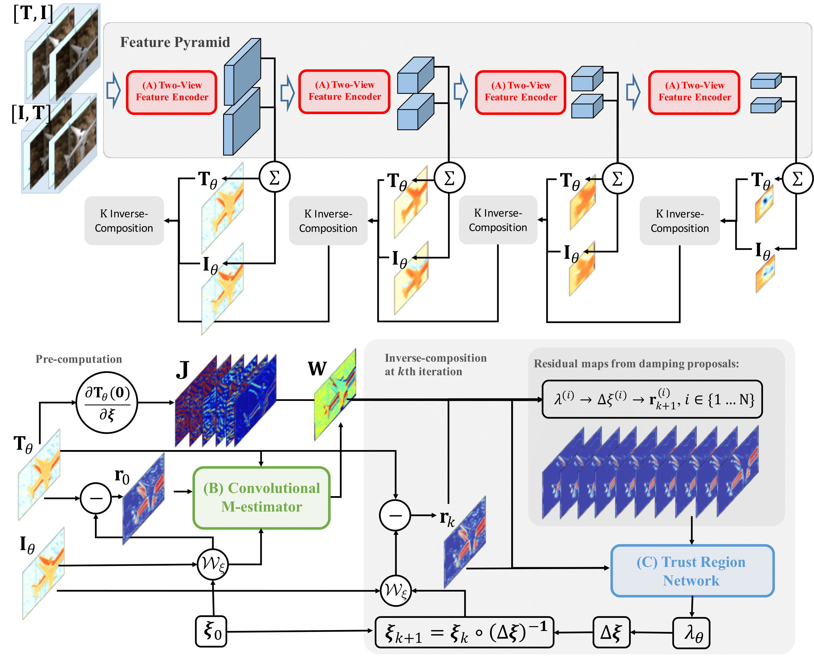

# Taking a Deeper Look at the Inverse Compositional Algorithm (CVPR 2019, Oral Presentation)



## Summary 

This is the official repository of our CVPR 2019 paper:

**Taking a Deeper Look at the Inverse Compositional Algorithm**,
*Zhaoyang Lv, Frank Dellaert, James M. Rehg, Andreas Geiger*,
CVPR 2019
 * [Preprint (PDF)][1]
 * [Video talk][2]

```bibtex
@inproceedings{Lv19cvpr,  
  title     = {Taking a Deeper Look at the Inverse Compositional Algorithm}, 
  author    = {Lv, Zhaoyang and Dellaert, Frank and Rehg, James and Geiger, Andreas},  
  booktitle = {CVPR},  
  year      = {2019}  
}
```

### Project Members

* [Zhaoyang Lv][3], Georgia Institute of Technology (Ph.D. student), Max Planck Institute (Alumni)
* [Frank Dellaert][4], Georgia Institute of Technology
* [James M. Rehg][5], Georgia Institute of Technology
* [Andreas Geiger][6], Max Planck Institute, University of Tuebingen

### Contact

Please drop me an email if you have any questions regarding this project. Please also do not hesitate to contact me if you have any requests for your current projects before you have access to the code.

Zhaoyang Lv (zhaoyang.lv@gatech.edu, lvzhaoyang1990@gmail.com)

### Setup 

The code is developed using Pytorch 1.0, CUDA 9.0, Ubuntu16.04. Pytorch > 1.0 and Cuda > 9.0 were also tested in some machines. If you need to integrate to some code bases which are using Pytorch < 1.0, note that some functions (particularly the matrix inverse operator) are not backward compatible. Contact me if you need some instructions.

You can reproduce the setup by using our anaconda environment configurations 

``` bash!
conda env create -f setup/environment.yml
```

### Quick Inference Example

### 

#### Prepare the datasets

* TUM RGBD Dataset: download the dataset from [TUM RGBD][7] to '$TUM_RGBD_DIR'. Create a symbolic link to the data directory as 

```
ln -s $TUM_RGBD_DIR code/data/data_tum
```

Train your algorithm 

### Run evaluate with the pretrained models 

Run the learned model 

``` bash!
python evaluate.py --dataset TUM_RGBD \
--trajectory fr1/rgbd_dataset_freiburg1_360 \
--encoder_name ConvRGBD2 \
--mestimator MultiScale2w \
--solver Direct-Nodamping \
--keyframes 1 # optionally 1,2,4,8 \
--checkpoint trained_models/TUM_RGBD_ABC_final.pth.tar
```

**Run a baseline:** We provide the vanilla Lucas-Kanade method minizing the photometric error without any learning module. Note that it is **not** the [RGBD VO baseline][8] we report in the paper. It is not the optimal Lucas-Kanade baseline since we use the same stopping criterion, Gauss-Newton solver within the same framework as our learned model, which does not contain extra bells and whistles.

``` bash!
python evaluate.py --dataset TUM_RGBD \
--trajectory fr1/rgbd_dataset_freiburg1_360 \
--encoder_name RGB --mestimator None --solve Direct-Nodamping \
--keyframes 1 # optionally 1,2,4,8, etc.
```


[1]: https://arxiv.org/pdf/1812.06861.pdf
[2]: https://youtu.be/doTjXDFtyK0
[3]: https://www.cc.gatech.edu/~zlv30/
[4]: https://www.cc.gatech.edu/~dellaert/FrankDellaert/Frank_Dellaert/Frank_Dellaert.html
[5]: https://rehg.org/
[6]: http://www.cvlibs.net/
[7]: https://vision.in.tum.de/data/datasets/rgbd-dataset/download
[8]: https://vision.cs.tum.edu/_media/spezial/bib/steinbruecker_sturm_cremers_iccv11.pdf 